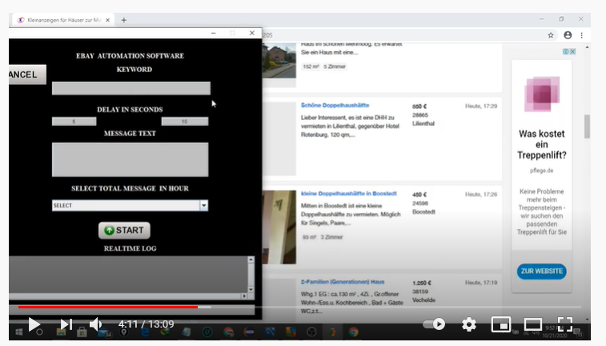

# E-bay-Automation

### User story/ User requirements:

The user wanted an automated solution that can find out a suitable listing with keywords and message the poster.

### Steps to automate:

* Calculate the total number of listings.
* Check for such listing that matches a given keyword
* If found, open the listing in a new tab
* Message the lister with a given message text
* Close the new tab and switch back to the previous window
* Continue looking for a new listing
* Navigate to the new page if there are any
* Continue untill all the pages have been checked

### Final result :

